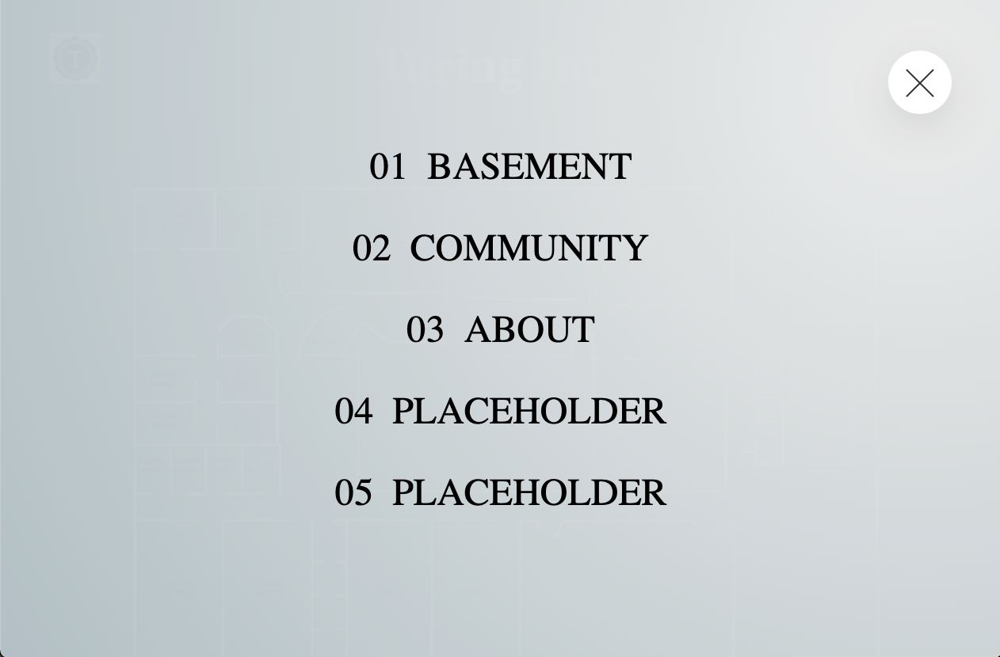

[![Contributors][contributors-shield]][contributors-url]
[![Forks][forks-shield]][forks-url]
[![Stargazers][stars-shield]][stars-url]
[![Issues][issues-shield]][issues-url]
<!-- [![LinkedIn][linkedin-shield]][linkedin-url] -->

<br />
<p align="center">
  <a href="">
    
  </a>

  <h3 align="center">https://github.com/the-turing-index/web-app</h3>

  <p align="center">
    <br />
    <a href="git hub url"><strong>Explore the docs »</strong></a>
    <br />
    <br />
    <a href="git hub url">View Demo</a>
    ·
    <a href="git hub url/issues">Report Bug</a>
    ·
    <a href="git hub url/issues">Request Feature</a>
  </p>
</p>

## Table of Contents

* [About the Project](#about-the-project)
  * [Built With](#built-with)
* [Getting Started](#getting-started)
  * [Prerequisites](#prerequisites)
  * [Installation](#installation)
* [Usage](#usage)
* [Roadmap](#roadmap)
* [Contact](#contact)
* [Acknowledgements](#acknowledgements)


<!-- ABOUT THE PROJECT -->
## About The Project




Just because we are learning remote, this doesn't mean you cannot enjoy the Turing campus experience. Come roam the digital halls of Turing and allow us to help you find your digital class room. Just because we are learning from home doesn't mean we can't experience basement life at Turing. As our final project we wanted to bring the Turing experience to future cohorts to enjoy, living the basement life.

Here's why:
* Your time should be focused on creating something amazing. A project that solves a problem and helps others
* You shouldn't be doing the same tasks over and over like creating a README from scratch
* You should element DRY principles to the rest of your life :smile:

Of course, no one template will serve all projects since your needs may be different. So I'll be adding more in the near future. You may also suggest changes by forking this repo and creating a pull request or opening an issue.

A list of commonly used resources that I find helpful are listed in the acknowledgements.

### Built With
This section should list any major frameworks that you built your project using. Leave any add-ons/plugins for the acknowledgements section. Here are a few examples.

* [Angular](https://angular.io/)
* [Sass](https://sass-lang.com/)
* [Travis CI](https://travis-ci.org/)
* [TypeScript](https://www.typescriptlang.org/)


<!-- GETTING STARTED -->
## Getting Started

This is an example of how you may give instructions on setting up your project locally.
To get a local copy up and running follow these simple example steps.

### Prerequisites

This is an example of how to list things you need to use the software and how to install them.
* npm
```sh
npm install npm@latest -g
```

### Installation


1. Clone the repo
```sh
git clone https://github.com/the-turing-index/web-app.git
```
3. Install NPM packages
```sh
npm install
```
4. Run:
 ```sh
 ng serve --open
 ```


<!-- USAGE EXAMPLES -->
## Usage

Use this space to show useful examples of how a project can be used. Additional screenshots, code examples and demos work well in this space. You may also link to more resources.

_For more examples, please refer to the [Documentation](https://example.com)_


<!-- ROADMAP -->
## Roadmap

See the [open issues](https://github.com/the-turing-index/web-app/issues) for a list of proposed features (and known issues).


<!-- CONTACT -->
## Contact

Nicole Latifi - email@example.com

AJ Tran -  email@example.com

Linus Leas - email@example.com

Ashkan Abbasi - email@example.com

Joshua Sevy - email@example.com

Michael Evans -  email@example.com


Project Link: [Heroku Deployed App](https://github.com/your_username/repo_name)


<!-- ACKNOWLEDGEMENTS -->
## Acknowledgements
* [GitHub Emoji Cheat Sheet](https://www.webpagefx.com/tools/emoji-cheat-sheet)
* [Img Shields](https://shields.io)
* [GitHub Pages](https://pages.github.com)


<!-- MARKDOWN LINKS & IMAGES -->
<!-- https://www.markdownguide.org/basic-syntax/#reference-style-links -->
[contributors-shield]: https://img.shields.io/github/contributors/the-turing-index/web-app.svg?style=flat-square
[contributors-url]: https://github.com/the-turing-index/web-app/graphs/contributors
[forks-shield]: https://img.shields.io/github/forks/the-turing-index/web-app.svg?style=flat-square
[forks-url]: https://github.com/the-turing-index/web-app/network/members
[stars-shield]: https://img.shields.io/github/stars/the-turing-index/web-app.svg?style=flat-square
[stars-url]: https://github.com/the-turing-index/web-app/stargazers
[issues-shield]: https://img.shields.io/github/issues/the-turing-index/web-app.svg?style=flat-square
[issues-url]: https://github.com/the-turing-index/web-app/issues
[license-shield]: https://img.shields.io/github/license/the-turing-index/web-app.svg?style=flat-square
[license-url]: https://github.com/the-turing-index/web-app/blob/master/LICENSE.txt
[product-screenshot]: images/screenshot.png
