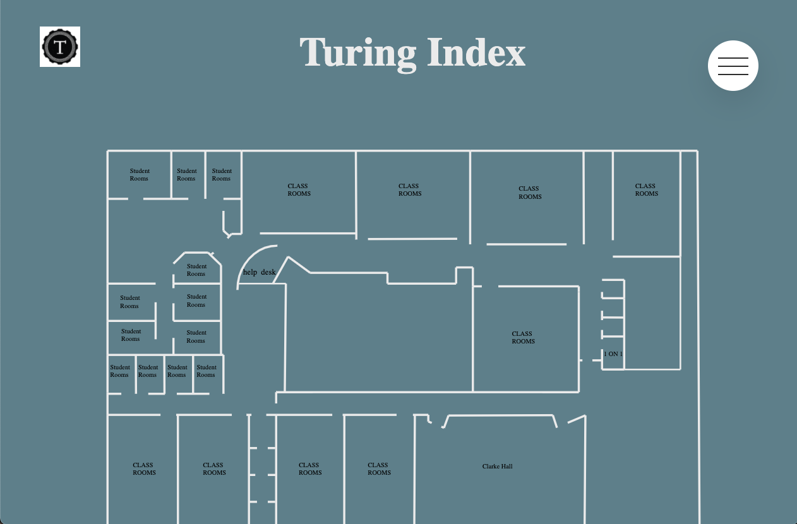
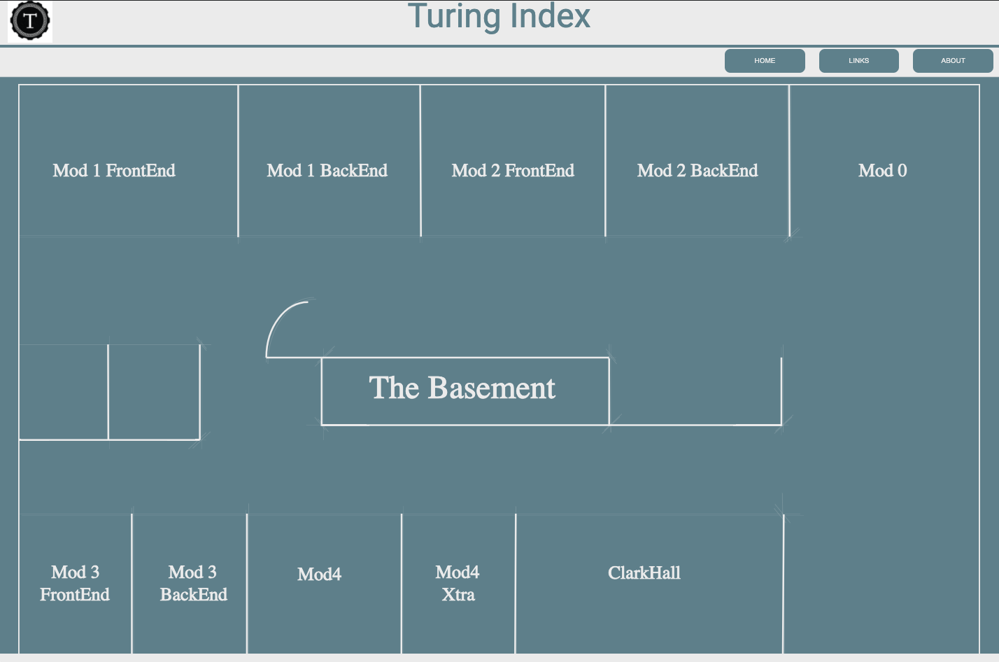

[![Contributors][contributors-shield]][contributors-url]
[![Forks][forks-shield]][forks-url]
[![Stargazers][stars-shield]][stars-url]
[![Issues][issues-shield]][issues-url]


<br />
<p align="center">
  <a href="">
    
  </a>
  <h3 align="center">Turing Index</h3>

  <p align="center">
    <br />
    <a href="https://github.com/the-turing-index/web-app"><strong>Explore the docs »</strong></a>
    <br />
    <br />
    <a href="https://turing-index-web.herokuapp.com/">View Demo</a>
    ·
    <a href="https://github.com/the-turing-index/web-app/issues">Report Bug</a>
    ·
    <a href="https://github.com/the-turing-index/web-app/issues">Request Feature</a>
  </p>
</p>

## Table of Contents

* [About the Project](#about-the-project)
  * [Built With](#built-with)
* [Getting Started](#getting-started)
  * [Prerequisites](#prerequisites)
  * [Installation](#installation)
* [Usage](#usage)
* [Roadmap](#roadmap)
* [Contact](#contact)
* [Acknowledgements](#acknowledgements)


<!-- ABOUT THE PROJECT -->
## About The Project

Just because we are learning remote, this doesn't mean you cannot enjoy the Turing campus experience. Come roam the digital halls of Turing and allow us to help you find your digital class room. Just because we are learning from home doesn't mean we can't experience basement life at Turing. As our final project we wanted to bring the Turing experience to future cohorts to enjoy, living the basement life.







### Built With
This section should list any major frameworks that you built your project using. Leave any add-ons/plugins for the acknowledgements section. Here are a few examples.

* [Angular](https://angular.io/)
* [Sass](https://sass-lang.com/)
* [Travis CI](https://travis-ci.org/)
* [TypeScript](https://www.typescriptlang.org/)


<!-- GETTING STARTED -->
## Getting Started

This is an example of how you may give instructions on setting up your project locally.
To get a local copy up and running follow these simple example steps.

### Prerequisites

This is an example of how to list things you need to use the software and how to install them.
* `npm`

```sh
npm install npm@latest -g
```

### Installation


1. Clone the repo
```sh
git clone https://github.com/the-turing-index/web-app.git
```
2. cd ('directory name')

3. Install NPM packages
```sh
npm install
```
4. Run:
 ```sh
 ng serve --open
 ```

<!-- ROADMAP -->
## Roadmap

See the [open issues](https://github.com/the-turing-index/web-app/issues) for a list of proposed features (and known issues).

<!-- CONTACT -->
## Contact

Nicole Latifi - Nicole.Latifi@gmail.com

AJ Tran - ajtrandev@gmail.com

Linus Leas - phoenix_24leas@yahoo.com

Ashkan Abbasi - ashkanthegreat@gmail.com

Joshua Sevy - joshuasevy@outlook.com

Michael Evans - michaeljevans113@gmail.com


Project Link: [Turing Index](https://turing-index-web.herokuapp.com/)


<!-- ACKNOWLEDGEMENTS -->
## Acknowledgements
* [GitHub Emoji Cheat Sheet](https://www.webpagefx.com/tools/emoji-cheat-sheet)
* [Img Shields](https://shields.io)


<!-- MARKDOWN LINKS & IMAGES -->
<!-- https://www.markdownguide.org/basic-syntax/#reference-style-links -->
[contributors-shield]: https://img.shields.io/github/contributors/the-turing-index/web-app.svg?style=flat-square
[contributors-url]: https://github.com/the-turing-index/web-app/graphs/contributors
[forks-shield]: https://img.shields.io/github/forks/the-turing-index/web-app.svg?style=flat-square
[forks-url]: https://github.com/the-turing-index/web-app/network/members
[stars-shield]: https://img.shields.io/github/stars/the-turing-index/web-app.svg?style=flat-square
[stars-url]: https://github.com/the-turing-index/web-app/stargazers
[issues-shield]: https://img.shields.io/github/issues/the-turing-index/web-app.svg?style=flat-square
[issues-url]: https://github.com/the-turing-index/web-app/issues
[license-shield]: https://img.shields.io/github/license/the-turing-index/web-app.svg?style=flat-square
[license-url]: https://github.com/the-turing-index/web-app/blob/master/LICENSE.txt
[product-screenshot]: images/screenshot.png
